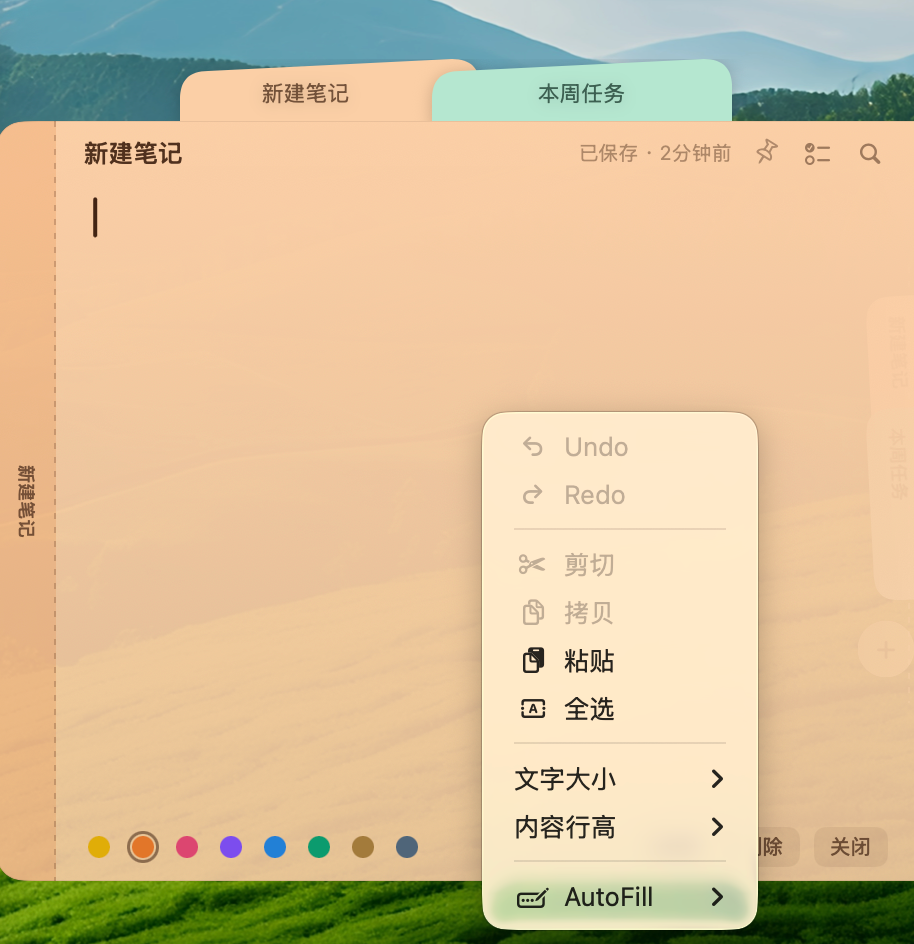

# Noty

停靠在屏幕边缘的便签应用。使用 Swift、SwiftUI 和 AppKit 开发的原生
macOS 应用。

没有 Dock 图标，也不需要管理窗口。将鼠标移到屏幕右边缘，便签卡组就会展开。

**[项目主页](https://noty-sepia.vercel.app)** ·
**[下载最新 DMG](https://github.com/aimen08/noty/releases/latest/download/Noty.dmg)**


| 收起                                                      | 展开                                                 | 打开的便签                                           |
| --------------------------------------------------------- | ---------------------------------------------------- | ---------------------------------------------------- |
|  |  |  |

## 三种状态，一次移动

| 状态     | 视觉效果                                                                    | 触发方式       |
| -------- | --------------------------------------------------------------------------- | -------------- |
| **收起** | 屏幕边缘显示一个 12 pt 的胶囊条，每张便签对应一条彩色短线                   | 空闲           |
| **展开** | 便签以相隔 45 ms 的节奏沿边缘交错展开为竖直标签，保留各自颜色，标题旋转显示 | 鼠标进入胶囊条 |
| **打开** | 便签以完整尺寸从卡组中滑出，与自己的标签对齐，标签仍显示在后方              | 点击标签       |

卡组一次最多显示 **五张便签**，其余便签收纳在 `+N` 标签后面。点击该标签
即可在可滚动的卡组中查看完整列表。卡组展开时，底部角落还会显示一个 `+` 按钮。

标签采用 **交错叠放**：每个标签保持完整高度，但只露出前一个标签下方的一小段，
像屋瓦一样层层覆盖。这样卡组的总高度约为屏幕的一半，而不会占满整个屏幕。
露出的部分会根据当前卡组中最长的标题调整宽度，标题会完整显示或优雅省略，
不会在单词中间被截断。

展开后的卡组宽度只有 56 pt，几乎不会遮挡后面的内容。

### 两种卡组样式

右键点击胶囊条 → **卡组样式**：

|                |                                            |
| -------------- | ------------------------------------------ |
| **带标题标签** | 显示完整尺寸并携带标题的标签（默认）       |
| **纯色圆角块** | 只显示颜色、不显示标题，卡组收缩为一行色块 |

打开的便签会将自己的标签作为左侧边栏一并带出，中间用虚线分隔，
看起来像是从卡组中长出来，而不是悬浮在旁边。

## 快捷键

所有快捷键都列在设置（`⌘,`）中，前四个可以在那里重新绑定。全局快捷键通过
Carbon hotkey API 注册，因此**不需要辅助功能权限**：

|       |                      |
| ----- | -------------------- |
| `⌥⌘N` | 新建便签（直接打开） |
| `⌥⌘A` | 全部便签             |
| `⌥⌘L` | 归档窗口             |

便签内部：

|             |                                      |
| ----------- | ------------------------------------ |
| `Esc`       | 关闭便签，返回标签页（或关闭查找栏） |
| `⌘F`        | 在便签中查找                         |
| `⌘.`        | 切换便签颜色                         |
| `⌘T`        | 将当前行设为任务，或移除复选框       |
| `⌘⌫`        | 删除，十秒内可以撤销                 |
| `⇧⌘A`       | 归档当前便签                         |
| `⌘P`        | 固定便签，使其保持打开               |
| `⌃+` / `⌃-` | 增大 / 减小便签文字                  |

标准编辑快捷键（`⌘C` / `⌘V` / `⌘Z` / `⌘A`）在任何位置都可用。应用启动时
会创建主菜单，专门用于分发这些快捷键；虽然 accessory 应用本身不显示菜单栏。

## 待办任务

任何一行都可以设为任务。`⌘T`（或便签标题栏中的清单按钮）会在当前行添加复选框；
**点击复选框即可完成任务**，该行会显示删除线并变暗。按回车会在下一行继续任务列表，
在空任务上按回车则结束列表。

任务以 `☐` / `☑` 前缀直接保存在便签正文中，因此正文仍是纯文本。导出 Markdown
时会转换为标准的 `- [ ]` / `- [x]` 任务语法，导入时也会转换回来。全部便签列表
会显示每张便签的 `已完成/总数`。

## 其他功能

- **归档而非删除。** 归档会将便签从卡组中移除，但仍保留在“全部便签 → 归档”中，
  随时可以恢复。
- **全部便签**（`⌥⌘A`）——单独的窗口，可搜索所有便签的标题和正文，并提供可编辑的详情面板。
- **多显示器**——每个屏幕右侧都有一个休眠状态的胶囊条。鼠标进入哪个屏幕，
  卡组就在哪个屏幕展开，其他卡组保持关闭。显示器通过 `CGDirectDisplayID` 跟踪，
  热插拔后会自动重建卡组。
- **覆盖全屏应用**——右键点击胶囊条 → _在全屏应用上显示_。这会将面板提升到
  `.statusBar` 层级；仅使用 `.floating` 无法显示在全屏空间上方。
- **自动保存**——停止输入 250 ms 后自动保存，关闭便签时还会再次保存。
- **设置**（`⌘,` 或右键点击胶囊条）——重新绑定快捷键，选择便签字体、字号和内容行高，
  设置鼠标距离屏幕边缘多远时唤醒卡组，并开关 Markdown 样式。所有设置立即生效。
- **边输入边显示 Markdown 样式。** `# 标题`、`**粗体**`、`*斜体*`、`` `代码` ``、
  `~~删除线~~`、`> 引用` 和 `- 列表` 会直接应用样式。标记会变暗而不是隐藏，
  因此保存和导出的文本与输入内容完全一致。
- **拖拽排序。** 按住标签并上下拖动即可调整便签顺序。
- **固定便签。** 点击标题栏中的图钉（或按 `⌘P`）后，便签不会因为非目标操作而关闭，
  例如切换到其他应用或长时间无操作。`Esc` 和“关闭”仍然可以关闭它。固定的标签
  会显示一个圆点，固定状态也会被记住。
- **关闭便签后返回卡组。** 按 `Esc`、点击“关闭”、归档或删除后，标签会保持原位；
  只有离开屏幕边缘，卡组才会重新收起。点击其他应用会关闭整个卡组。
- **自动收起。** 展开后的卡组闲置 4 秒后收起；打开的便签闲置 1 分钟后关闭。
- **导出**——支持 Markdown（每张便签一个 `.md`）、纯文本（每张便签一个 `.txt`）、
  单个文档，或保留颜色、归档状态和日期的 `.stickies` 归档文件。**导入**支持
  `.stickies`，也支持直接导入 `.md` / `.txt` 文件。
- 右键点击胶囊条可打开完整菜单：新建便签、窗口、边缘位置、登录时启动、导出、导入和退出。

## 你的便签留在 Mac 本地

- 本地 SQLite 数据库位于 `~/Library/Application Support/Noty/`。
- **便签正文使用 AES-GCM 加密**（CryptoKit，256 位）。标题、颜色和时间戳保持明文，
  这样列表无需解密每一行就能正常渲染。
- 不需要账号、服务器、分析服务、遥测或跟踪 SDK。
- **应用只会发起一次网络请求：** Sparkle 获取 appcast，检查是否有新版本。
  便签内容不会被发送——这只是对公开 XML 文件的普通 GET 请求。可以在胶囊条菜单中
  关闭“自动检查”，关闭后将不会再发起该请求。
- 不需要辅助功能权限、屏幕录制权限或其他系统权限。

你可以自行验证：

```sh
sqlite3 ~/Library/Application\ Support/Noty/notes.db "SELECT hex(substr(body,1,24)) FROM notes;"
strings ~/Library/Application\ Support/Noty/notes.db | grep "some text from a note body"   # finds nothing
```

## 构建

需要 Command Line Tools 中的 Swift 工具链（**不需要 Xcode**）以及 macOS 15 或更高版本。

```sh
./scripts/fetch-sparkle.sh   # 首次执行：下载 Sparkle 二进制框架
./build.sh                   # Release 构建 → build/Noty.app
./build.sh debug             # 快速、未优化的 Debug 构建
./build.sh release run       # 构建后重新启动应用
open build/Noty.app
```

`build.sh` 直接调用 `swiftc` 编译 `Sources/*.swift`，根据 `Info.plist` 组装
`.app` 包，嵌入 Sparkle 并完成签名。

Sparkle 是可选依赖。没有 `Sparkle/Sparkle.framework` 时应用仍然可以构建，
`Updater.swift` 会编译为占位实现，更新菜单会相应提示。

### 发布

```sh
git tag v1.0.1 && git push origin v1.0.1
```

这会触发 `.github/workflows/release.yml`：构建应用、打包 DMG、使用 EdDSA 密钥签名、
写入 `appcast.xml`、发布 GitHub Release，并提交 appcast，让已安装的应用能够发现更新。

它需要一个仓库密钥 **`SPARKLE_PRIVATE_KEY`**，即由
`scripts/fetch-sparkle.sh` 工具链生成的私钥内容。匹配的公钥已经写入 `Info.plist`
中的 `SUPublicEDKey`；使用其他密钥签名的更新会被已安装的应用拒绝。

手动构建 DMG：

```sh
./build.sh release && ./scripts/make-dmg.sh 1.0.1
```

**签名说明。** Sparkle 使用其自身团队签名发布，dyld 会拒绝加载 Team ID 与进程
不同的框架。因此 `build.sh` 会从最内层的 bundle 开始，使用与应用相同的身份重新签名
框架。设置 `CODESIGN_IDENTITY` 可以使用 Developer ID，而不是 ad-hoc 签名。

## 目录结构

```
Sources/
  Main.swift            @main 入口；NSApplication、accessory 策略
  AppDelegate.swift     应用连接、操作和主菜单
  Core.swift            路径、AES-GCM 加密、颜色调色板和 Note 模型
  Store.swift           SQLite（C API）——建表、加载、写入、删除
  NoteStore.swift       可观察模型；统一数据源
  Settings.swift        UserDefaults 设置和登录时启动
  HotKeys.swift         Carbon 全局快捷键（无需权限）
  DeckPanel.swift       几何布局、NSPanel 子类和跟踪容器
  DeckController.swift  每个显示器一个卡组，以及状态机
  DeckViews.swift       胶囊条、扇出、标签和 45 ms 交错动画
  NoteEditor.swift      NSTextView 桥接、查找和 250 ms 自动保存
  LibraryWindow.swift   全部便签 / 归档
  ExportImport.swift    md / txt / 单文件 / .stickies
  UndoToast.swift       删除后的十秒撤销提示
```

如果要修改卡组功能，以下四点值得注意：

- 无边框的 `.nonactivatingPanel` 默认从 `canBecomeKey` 返回 `false`，因此必须重写它，
  否则展开的便签无法接收键盘输入。
- 视图的 `acceptsFirstMouse` 默认是 `false`。如果不重写，点击标签时第一次点击只会
  激活面板，而不会打开便签；但用户从其他应用触碰卡组时，第一次点击正是常见情况。
- 交错叠放依赖 **ZStack 的声明顺序**，而不是 `zIndex`。为每个标签设置显式 `zIndex`
  会改变相邻标签的绘制顺序，破坏叠放效果。
- `rotationEffect` 是绘制变换而不是布局变换：旋转后的标签仍按未旋转宽度测量，
  因此围绕它布局的内容必须单独约束和裁剪，否则会溢出到便签上。

设置环境变量 `NOTY_DEBUG_DECK=1`，即可将卡组状态变化追踪信息输出到 stderr。

## 与原版的区别

- **未启用沙盒**，因此数据位于 `~/Library/Application Support/Noty/`，而不是
  `~/Library/Containers/`。启用沙盒需要 provisioning profile，而这又需要 Xcode 和开发者账号。
- AES 密钥是数据库旁边的 `0600` 文件。在正式分发版本中，Keychain 是更合适的存储位置；
  但 ad-hoc 签名每次重新构建都会变化，使用 Keychain 会导致应用每次重新请求授权或被拒绝。
- 这里的 `.stickies` 是 Noty 自己的 JSON 归档格式；原版格式是不透明的，因此两者不能互换。
  Noty 可以完整地导入自己导出的归档。
- 没有许可证、试用或更新机制。
- 使用 ad-hoc 签名且未经公证。如果将应用移到其他位置，Gatekeeper 首次打开时可能要求
  右键点击 →“打开”。

## 许可证

MIT——详见 [LICENSE](LICENSE)。你可以自由使用，但请保留版权声明。

Noty 使用 [Sparkle](https://github.com/sparkle-project/Sparkle)（同样采用 MIT 许可证）
处理更新。其声明已写入 [licenses/THIRD-PARTY.txt](licenses/THIRD-PARTY.txt)，
并复制到 `Noty.app/Contents/Resources/`，因此会按照许可证要求随每个 DMG 一起分发。
